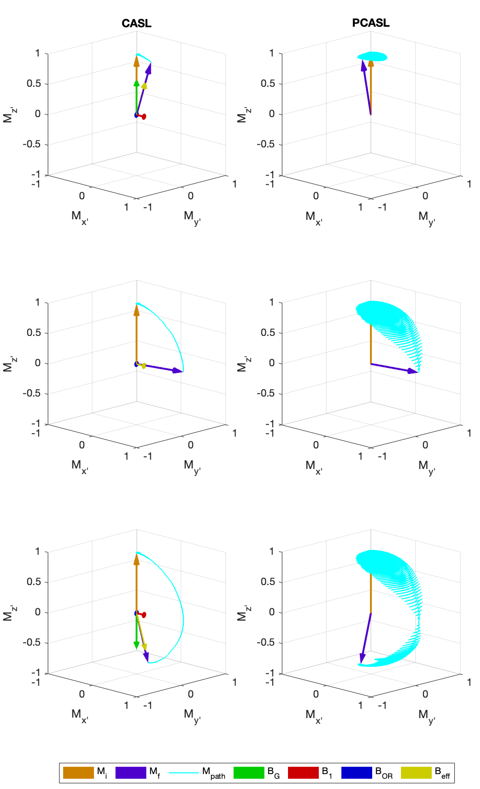
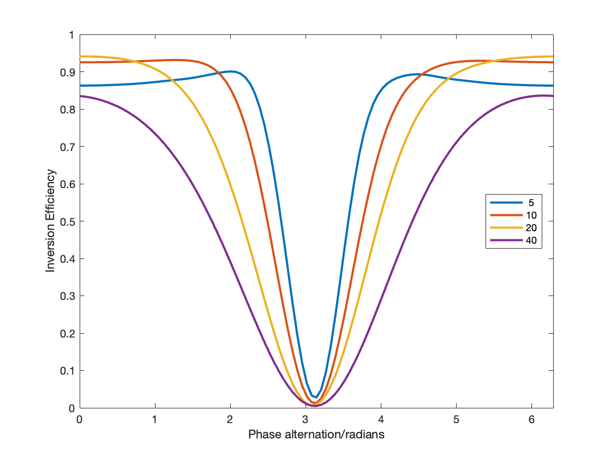

# Bloch Simulator for MRI pulse sequences

A general Bloch equation simulator, using the effective field approach, written in Matlab, including example code to estimate Pseudocontinuous Arterial Spin Labeling (PCASL) and Vessel-Encoded PCASL (VEPCASL) inversion efficiency and spatial modulation functions under various conditions.

Example simulation showing the continuous and pseudocontinuous ASL flow-driven inversion processes:

Another example showing the modulation of inversion efficiency across space produced by using vessel-encoded PCASL for various velocities (see legend, in cm/s):

## Getting started
Download this repo or clone in a terminal using:

`git clone https://github.com/tomokell/bloch_sim`

Then within Matlab, make sure you add all the subdirectories of this repo to the path, e.g.:

`>> addpath(genpath('path/to/repo'))`

After that, you should be able to run one of the example scripts e.g. to generate the figure above, try:

`>> VisualiseCASLvsPCASLinversion`

Or to examine the effect of velocity on PCASL inversion efficiency try:

`>> test_PCASL_v_dependence`

Below you will find a more detailed explanation of the code.

## Code structure
### Core Bloch simulation code (*Core_Bloch_Simulation*)
This subfolder contains the core Bloch simulation code, run via `bloch_sim`. It takes spin position, RF, gradient, off-resonance and relaxation parameters and iteratively calculates the state of the magnetisation at each time point. It uses an "effective field" approach, to calculate the combined effect of the RF pulses, gradients and off-resonance in a frame of reference rotating at $\omega = \gamma B_0$. The magnetisation is then rotated about this effective field before the relaxation is applied.

### Example Scripts (*Example_Scripts*)
This subfolder contains some example scripts that set up a pulse sequence and other necessary inputs before running the Bloch simulation code to test the effect of the sequence under various conditions. These include:
- `VisualiseCASLvsPCASLinversion.m`: Simulates a single spin undergoing flow driven (pseudo)adiabatic inversion for both continuous (CASL) and pseudocontinuous (PCASL) arterial spin labeling pulse sequences, producing the figure shown above.
- `test_PCASL_v_dependence.m`: Simulates a series of spins with varying velocities and determines the PCASL inversion efficiency for both label and control conditions. It also averages these values over a laminar flow profile.
- `test_VEPCASL_position_and_v_dependence.m`: Evaluates how the inversion efficiency varies across the labeling plane for vessel-encoded PCASL (VEPCASL) for various spin velocities, reproducing figures in various papers on this topic (see references below). 
- `test_VEPCASL_angle_and_v_dependence.m`: Tests the sensitivity of both PCASL and VEPCASL to the angle of the spin's motion relative to the labeling plane, and how this changes with spin velocity.
- `test_VEPCASL_v_and_ORFreq_dependence.m`: Evaluates the sensitivity of PCASL and VEPCASL to off-resonance frequency.
- `test_PCASL_RF_pulse_profiles.m`: Simulates the "slice profiles" of a variety of potential PCASL RF pulses.
- `test_PCASL_effect_on_static_spins.m`: Evaluates the perturbations to the static tissue due to the PCASL pulses, which can lead to artefact near the labeling plane.

Many of these reproduce figures you can find in my PhD thesis (referenced below), with some minor differences due to the exact RF pulse shapes used etc.

### Example pulse sequences (*Sequences*)
Code to generate PCASL and VEPCASL pulse sequences, RF pulses etc., as well as wrapper scripts to generate a pulse sequence and simulate a spin with a particular velocity, off-resonance etc., for ease of use.

### Utilities from others (*Utils*)
For visualising the magnetisation vectors (as above), we used the excellent `quiver3D` functions (cited below).

### Other functions (*Miscellaneous*)
General convenience functions, including those for averaging over a laminar flow profile.

### Figures (*Figs*)
Contains figures for this README file.

## References
This Bloch simulation code (and previous versions of it) were mainly developed for my PhD thesis work. The full thesis can be found here:

- Okell TW. Assessment of collateral blood flow in the brain using magnetic resonance imaging [PhD Thesis]. University of Oxford; 2011. [[available here](https://ora.ox.ac.uk/objects/uuid:7e63bcf2-22bf-49e5-81ec-1644217605ae)]

It has also been used in a number of publications, including:

- Okell TW, Chappell MA, Woolrich MW, Günther M, Feinberg DA, Jezzard P. Vessel-encoded dynamic magnetic resonance angiography using arterial spin labeling. Magn Reson Med. 2010; 64: 698–706. [[DOI link](http://doi.org/10.1002/mrm.22458)]
- Okell TW, Schmitt P, Bi X, Chappell MA, Tijssen RHN, Sheerin F, Miller KL, Jezzard P. Optimization of 4D vessel-selective arterial spin labeling angiography using balanced steady-state free precession and vessel-encoding. NMR in Biomedicine. 2016; 29: 776–786. [[DOI link](http://doi.org/10.1002/nbm.3515)]
- Berry ESK, Jezzard P, Okell TW. An Optimized Encoding Scheme for Planning Vessel-Encoded Pseudocontinuous Arterial Spin Labeling. Magnetic Resonance in Medicine. 2015; 74: 1248–1256. [[DOI link](http://doi.org/10.1002/mrm.25508)]
- Suzuki Y, van Osch MJP, Fujima N, Okell TW. Optimization of the spatial modulation function of vessel-encoded pseudo-continuous arterial spin labeling and its application to dynamic angiography. Magnetic Resonance in Medicine. 2019; 81: 410–423. [[DOI link](http://doi.org/10.1002/mrm.27418)]
- Larkin JR, Simard MA, Khrapitchev AA, Meakin JA, Okell TW, Craig M, Ray KJ, Jezzard P, Chappell MA, Sibson NR. Quantitative blood flow measurement in rat brain with multiphase arterial spin labelling magnetic resonance imaging. Journal of Cerebral Blood Flow & Metabolism. 2019; 39: 1557–1569. [[DOI link](http://doi.org/10.1177/0271678X18756218)]
- Chappell M, Okell TW, Jenkinson M. Short Introduction to MRI Physics for Neuroimaging.; 2017. [[available here](http://www.fmrib.ox.ac.uk/primers/appendices/mri_physics.pdf)].
- Okell TW, Hattingen E, Klein JC, Miller KL. Advanced MRI Methods. In: Diseases of the Spinal Cord. Berlin, Heidelberg: Springer Berlin Heidelberg; 2015. pp. 85–91. [[DOI link](http://doi.org/10.1007/978-3-642-54209-1_5)]
- Okell TW, Hattingen E, Klein JC, Miller KL. Magnetic Resonance Imaging (MRI) Methods. In: Diseases of the Spinal Cord. Berlin, Heidelberg: Springer Berlin Heidelberg; 2015. pp. 39–84. [[DOI link](http://doi.org/10.1007/978-3-642-54209-1_4)]

Other key references for PCASL and VEPCASL are:
- Dai W, Garcia D, de Bazelaire C, Alsop DC. Continuous flow-driven inversion for arterial spin labeling using pulsed radio frequency and gradient fields. Magnetic Resonance in Medicine. 2008; 60: 1488–1497. [[DOI link](http://doi.org/10.1002/mrm.21790)]
- Wong EC. Vessel-encoded arterial spin-labeling using pseudocontinuous tagging. Magnetic Resonance in Medicine. 2007; 58: 1086–1091. [[DOI link](http://doi.org/10.1002/mrm.21293)]
- Wong EC, Guo J. Blind detection of vascular sources and territories using random vessel encoded arterial spin labeling. Magnetic Resonance Materials in Physics, Biology and Medicine. 2012; 25: 95–101. [[DOI link](http://doi.org/10.1007/s10334-011-0302-7)]

## Caveats
- Most of this code was written back in 2008... I have tidied it up a little since then, but there may well be suboptimal coding, bugs etc., although it does replicate well the results from other papers (e.g. see `test_VEPCASL_position_and_v_dependence.m`). 
- Although fast enough for my purposes, there are no doubt more efficient Bloch simulators out there, so if you need speed, it might be worth exploring other options.
- The time step `dt` needs to be set short enough to sufficiently sample the RF and gradient waveforms. I have found it to be pretty robust until there are two few samples across e.g. an RF pulse to represent its shape correctly, but worth experimenting to make sure this is the case in new scenarios as well.
- There are mentions in the code of a Gaussian RF pulse from a DSV file. This data relies on a specific file and originates from an MRI scanner manufacturer so cannot be shared here.

## Dependencies
Tested most recently using MATLAB 2022a. Some of the scripts use `parfor` loops for speed which require the Parallel Computing Toolbox, although they should still run like a standard `for` loop without it.

To aid visualisation, the `quiver3D` functions are included in this repo, with some slight modifications, but the original version can be found here: [[Matlab Central Link](https://www.mathworks.com/matlabcentral/fileexchange/12285-3d-quiver-with-volumized-arrows)]

## Acknowledgements

Thanks to Peter Jezzard for his advice on implementing this simulation during my PhD. Thanks also to Shawn Arseneau for openly sharing the `quiver3D` functions that we utilise here.

## Contributors
Thomas W. Okell: https://orcid.org/0000-0001-8258-0659

Any updates, bug fixes and improved functionality welcome!

## How to cite

Okell TW (2023). Bloch Simulator for MRI pulse sequences: Initial release (v1.0.0). Zenodo. https://doi.org/10.5281/zenodo.7952965

## Copyright

Copyright © 2023, University of Oxford

